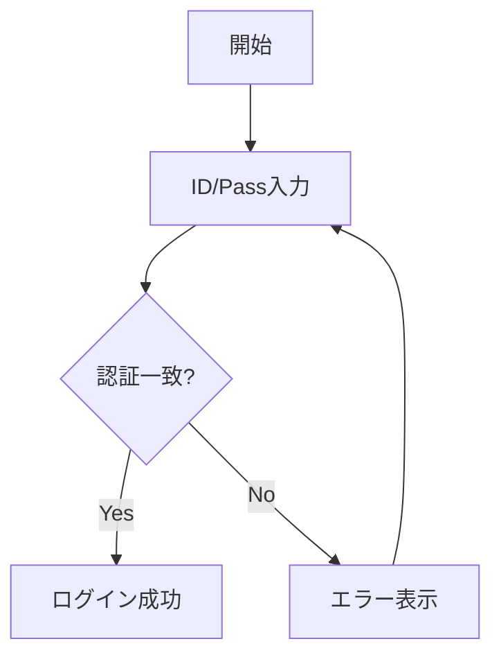
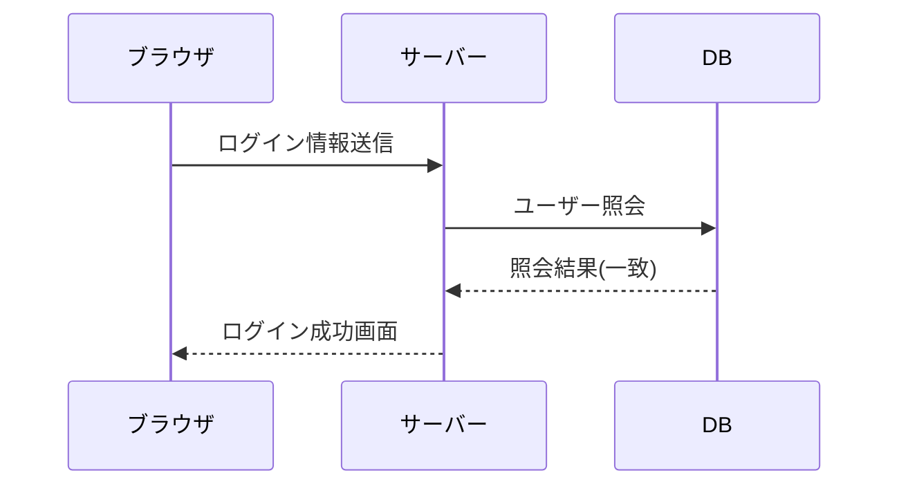

# MySite概要
このシステムは学校の  
授業の一環で…
#  野菜炒め
## 材料
- ニンジン
- キャベツ
- モヤシ
## 作り方
フライパンに油を…

# テーブル
| ページ | URL | サーブレット |
|:----------:|:----------|---------------:|
| ホーム | /home | HomeServlet |
| 会社概要 | /about | AboutServlet |
| 製品リスト | /products | ProductServlet |

# システム仕様書

## 以下は処理の流れです。(フローチャート)

## 以下は機能の流れです。(シーケンス図)
